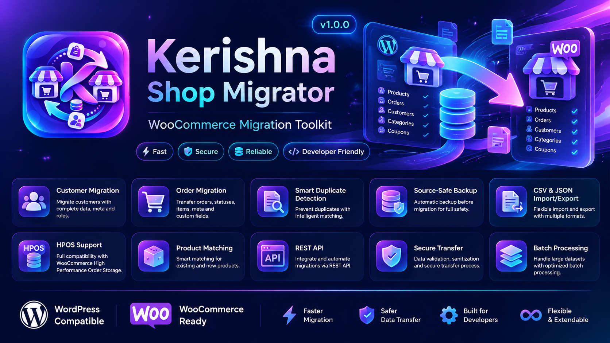
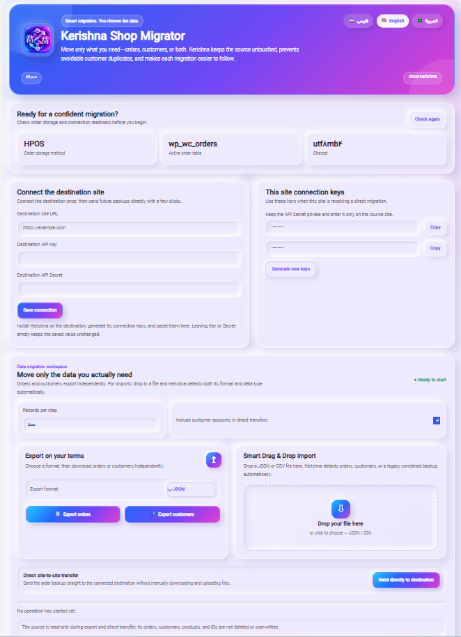

# 🛒 Kerishna Shop Migrator

**Professional WooCommerce Migration Toolkit for Secure, Fast and
Reliable Store Transfers**

 

------------------------------------------------------------------------

# 🌐 Documentation

-   🇬🇧 English
-   🇸🇦 العربية
-   🇮🇷 فارسی

------------------------------------------------------------------------

# 🇬🇧 English

## Overview

Kerishna Shop Migrator is a professional WooCommerce migration toolkit
designed to safely transfer store data between WordPress websites.

It provides a developer-friendly workflow for migrating customers,
orders, products, categories, coupons and WooCommerce related data while
keeping the source website protected.

Built for agencies, developers and store owners who need reliable
migrations with validation, duplicate protection and flexible data
handling.

## 🚀 Core Features

### 👥 Customer Migration

-   Transfer customer accounts
-   Preserve customer information
-   Support customer metadata
-   Maintain user related data
-   Safe customer matching

### 🛒 Order Migration

-   Transfer WooCommerce orders
-   Preserve order statuses
-   Move order items
-   Handle order metadata
-   Support complex order structures

### 🔍 Smart Duplicate Detection

-   Detect existing records
-   Prevent duplicate customers
-   Prevent duplicate orders
-   Smart matching logic
-   Safer migration workflow

### 💾 Source-Safe Backup Workflow

-   Protect source data
-   Prepare migration safely
-   Reduce migration risks
-   Validation before transfer

### 📦 Product Matching

-   Match existing products
-   Handle product relationships
-   Support WooCommerce product structures
-   Improve migration accuracy

### 📄 CSV / JSON Import & Export

-   Export store data
-   Import external migration files
-   Flexible data formats
-   Developer friendly workflow

### ⚡ Batch Processing

-   Handle large datasets
-   Optimized migration steps
-   Better performance for large stores

### 🗄️ HPOS Compatibility

-   WooCommerce High Performance Order Storage support
-   Modern order database compatibility

### 🔌 REST API Integration

-   API-based migration workflow
-   External automation support
-   Developer integration ready

### 🛡️ Secure Transfer Engine

-   Data validation
-   Secure communication
-   Controlled transfer process

------------------------------------------------------------------------

# 🆚 Free / Trial vs Pro Comparison

  Feature               Free / Trial   Pro
  --------------------- -------------- ----------------
  Customer Migration    Basic          Advanced
  Order Migration       Basic          Advanced
  Product Migration     Limited        Full
  Duplicate Detection   Basic          Smart Matching
  Backup Workflow       Included       Advanced
  CSV Import/Export     Limited        Full
  JSON Import/Export    Limited        Full
  HPOS Support          Basic          Advanced
  REST API              Limited        Full
  Batch Processing      Basic          Optimized
  Developer Tools       Limited        Advanced

------------------------------------------------------------------------

# 🇸🇦 العربية

## نظرة عامة

Kerishna Shop Migrator هي إضافة احترافية لـ WooCommerce لنقل بيانات
المتاجر بين مواقع WordPress بطريقة آمنة ومنظمة.

تم تصميم الإضافة للمطورين والشركات وأصحاب المتاجر الذين يحتاجون إلى نقل
العملاء والطلبات والمنتجات والبيانات المرتبطة بدون فقدان المعلومات.

## 🚀 المميزات الرئيسية

### 👥 نقل العملاء

-   نقل حسابات العملاء
-   الحفاظ على بيانات المستخدمين
-   نقل البيانات الإضافية
-   مطابقة العملاء بشكل آمن

### 🛒 نقل الطلبات

-   نقل طلبات WooCommerce
-   الحفاظ على حالات الطلبات
-   نقل عناصر الطلب
-   دعم البيانات المخصصة

### 🔍 اكتشاف التكرار الذكي

-   اكتشاف السجلات الموجودة
-   منع تكرار العملاء
-   منع تكرار الطلبات
-   مطابقة ذكية للبيانات

### 💾 النسخ الاحتياطي الآمن

-   حماية بيانات المصدر
-   تجهيز النقل بأمان
-   تقليل مخاطر الترحيل

### 📦 مطابقة المنتجات

-   ربط المنتجات الحالية
-   دعم علاقات WooCommerce
-   تحسين دقة النقل

### 📄 CSV / JSON

-   تصدير البيانات
-   استيراد ملفات النقل
-   دعم صيغ متعددة

### ⚡ المعالجة الجماعية

-   التعامل مع المتاجر الكبيرة
-   تحسين الأداء
-   تنفيذ مراحل النقل بكفاءة

### 🗄️ دعم HPOS

-   توافق مع WooCommerce High Performance Order Storage

### 🔌 REST API

-   تكامل خارجي
-   أتمتة عمليات النقل
-   أدوات للمطورين

------------------------------------------------------------------------

# 🇮🇷 فارسی

## معرفی

Kerishna Shop Migrator یک ابزار حرفه‌ای مهاجرت فروشگاه WooCommerce برای
انتقال امن اطلاعات بین سایت‌های وردپرسی است.

این افزونه برای توسعه‌دهندگان، آژانس‌ها و صاحبان فروشگاه طراحی شده تا
انتقال مشتریان، سفارش‌ها، محصولات و داده‌های مرتبط را با امنیت و کنترل
بالا انجام دهد.

## 🚀 قابلیت‌های اصلی

### 👥 مهاجرت مشتریان

-   انتقال حساب کاربران
-   حفظ اطلاعات مشتری
-   انتقال Metadata
-   تطبیق امن کاربران

### 🛒 مهاجرت سفارش‌ها

-   انتقال سفارش‌های WooCommerce
-   حفظ وضعیت سفارش
-   انتقال آیتم‌های سفارش
-   پشتیبانی از داده‌های سفارشی

### 🔍 تشخیص هوشمند داده‌های تکراری

-   شناسایی اطلاعات موجود
-   جلوگیری از ایجاد مشتری تکراری
-   جلوگیری از سفارش تکراری
-   Matching هوشمند

### 💾 فرآیند بکاپ امن

-   محافظت از سایت مبدا
-   آماده‌سازی قبل از انتقال
-   کاهش ریسک مهاجرت

### 📦 تطبیق محصولات

-   Matching محصولات
-   حفظ ارتباطات WooCommerce
-   افزایش دقت انتقال

### 📄 CSV / JSON

-   خروجی گرفتن اطلاعات
-   ورود فایل‌های مهاجرت
-   پشتیبانی فرمت‌های مختلف

### ⚡ پردازش دسته‌ای

-   مدیریت دیتای بزرگ
-   بهینه‌سازی سرعت انتقال
-   کنترل بهتر مراحل مهاجرت

### 🗄️ پشتیبانی HPOS

-   سازگار با WooCommerce High Performance Order Storage

### 🔌 REST API

-   توسعه‌پذیری بالا
-   اتوماسیون انتقال
-   ابزار مناسب توسعه‌دهندگان

------------------------------------------------------------------------

# 📸 Screenshots

## Dashboard

------------------------------------------------------------------------

# 🚀 Installation

1.  Upload the plugin to WordPress.
2.  Activate Kerishna Shop Migrator.
3.  Configure source and destination settings.
4.  Start secure migration workflow.

------------------------------------------------------------------------

# 👨‍💻 Developer

Developed by [SHABNAM.DEV](https://shabnam.dev/)
